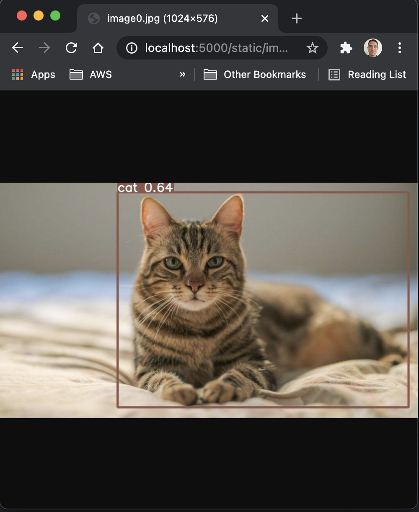

# YOLOv5+Flask

This repo contains example apps for exposing the [yolo5](https://github.com/ultralytics/yolov5) object detection model from local via a [flask](https://flask.palletsprojects.com/en/1.1.x/) api/app.

## Demo Show
Simple app consisting of a form where you can upload an image, and see the inference result of the model in the browser. Run:

`$ python3 webapp.py --port 5000`

then visit http://localhost:5000/ in your browser:

<p align="center">

</p>

<p align="center">

</p>


## Quick Start
This code use  yolov5s.pt(default) to inference, you can run following in terminal：
* `conda activate venv(your venv created before)`
* `(venv) $ pip install -r requirements.txt`
* `(venv) $ python3 webapp.py --port 5000`

## Docker
The example dockerfile shows how to expose the rest API:
```
# Build
docker build -t yolov5-flask .
# Run
docker run -p 5000:5000 yolov5-flask:latest
```

The more details could refer to my blog：[https://zstar.blog.csdn.net/]


## Reference

Thanks to their great works：

- https://github.com/ultralytics/yolov5
- https://github.com/robmarkcole/yolov5-flask

  
